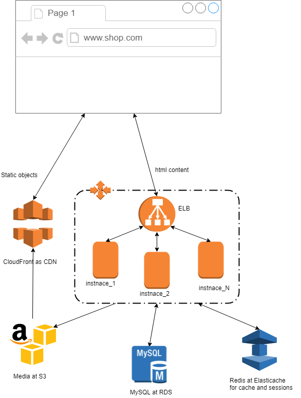

<h2>This code creates the following items:</h2>
<ol>
<li>Separate security groups for every autoscaling group</li>
<li>ELB in public subnet</li>
<li>Autoscaling group with instances to be launched in the private subnets</li>
<li>Autoscaling group for bastion host to be publicly available</li>
<li>S3 bucket for assets</li>
<li>IAM instance profile that can read and write files at assets s3 bucket</li>
<li>Aurora RDS cluster</li>
</ol>
<h2>TBD:</h2>
<ol>
<li>Elasticache redis</li>
<li> Switch to ALB from ELB</li>
<li>Cloudfront that reads files directly from s3 bucket</li>
<li>S3 replication for backup purposes</li>
<li>Enable infrastructure versioning</li>
<li>Defined deployment jobs</li>
</ol>
<h2>Here is what I'm thinking of:</h2>
</img>
